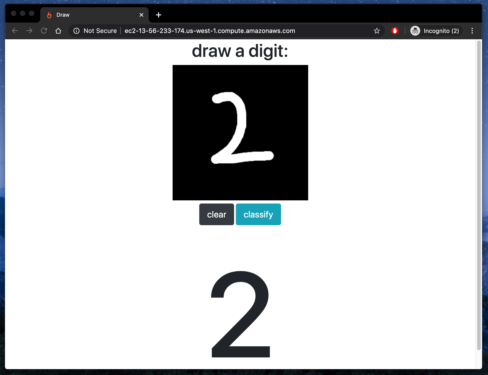

# mnist-cnn-demo

A demo of a Convolution Neural Network trained on MNIST data. The CNN is exposed as an HTTP endpoint using a Flask. The application is deployed as a Docker container on an EC2.

## Screenshot

